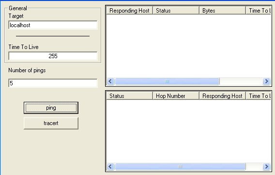



## ICMP Made Easy

### Description

This simple VB6 class allow you to send ping (Packet Internet Groper) and perform a trace route. Though you could expand it for use with other icmp responces. The class can easily be slotted into any application you wish but a simple interface is provided to try out. The code should be very stable no missing constants etc and doesnt lock up when a paticular point in the trace route doesnt respond (see notes in code). Anyway hope you like it.

Ps. Update 14 April 05 - updated for an overflow error when the tracert gets stuck waiting at a paticular place in the hop. Also added a screenshot though its the class that I submitted not the interface. Anyhow those of you having trouble with crashs the only thing I can think of is its something to do with the version of the icmp dll or winsock dll. I've tested it on ICMP.dll version 5.1.2600.2180 and have had no crashs at all. Even for addresses that dont exist even for planet-source-code.com. So check you have the latest icmp and latest winsock. One of you reported it happened on both ping and tracert so its probably the actual ICMP echo thats falling over.
 
### More Info
 
Expect arguments for packet size in the near future. Its easily added i just havent done it yet.

Only one that i'm aware of for some reason the raiseevent in the winsock startup sub wont fire. It only gives details on the winsock connection and the code runs fine anyway. But if someone sees/knows why it doesnt work i would really appreciate it.

             |
---                |---
**Submitted On**   |2005-04-14 16:05:12
**By**             |[Richard Brisley](https://github.com/Planet-Source-Code/PSCIndex/blob/master/ByAuthor/richard-brisley.md)
**Level**          |Advanced
**User Rating**    |4.9 (44 globes from 9 users)
**Compatibility**  |VB 6\.0
**Category**       |[Internet/ HTML](https://github.com/Planet-Source-Code/PSCIndex/blob/master/ByCategory/internet-html__1-34.md)
**World**          |[Visual Basic](https://github.com/Planet-Source-Code/PSCIndex/blob/master/ByWorld/visual-basic.md)
**Archive File**   |[ICMP\_Made\_1876804142005\.zip](https://github.com/Planet-Source-Code/richard-brisley-icmp-made-easy__1-59864/archive/master.zip)

